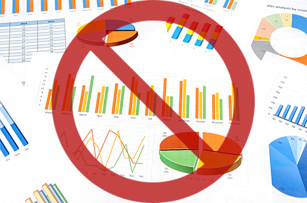
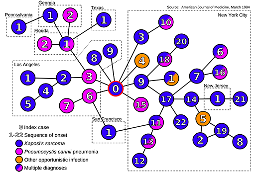
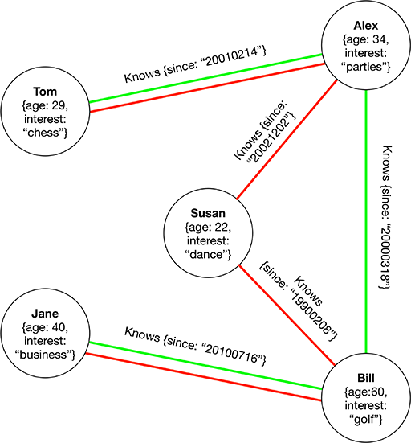
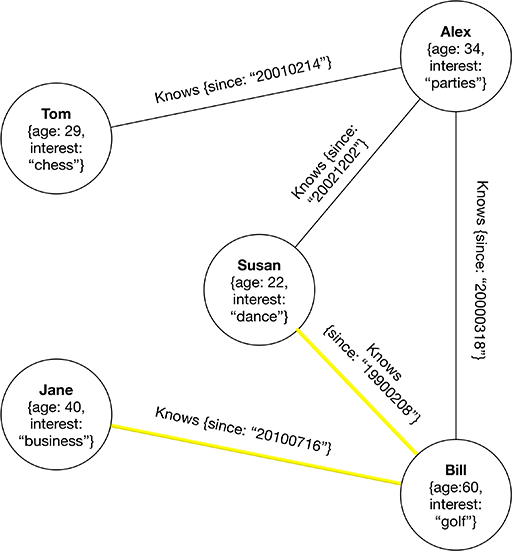

# Graphs, GraphDBs and JavaScript

In this article, we're going to look at Graph Databases. Before we explore them, we'll consider the importance of graphs, the underlying data structure that allows GraphDBs to exist.

Undoubtedly you're familiar with graphs - those charts showing colored bars, pie slices and points along a line. They're great data visualization tools designed to quickly convey information. However, those are not the types of graphs we'll consider.



The graphs we're interested in consists of circles and lines and are commonly known as network graphs.


This is the same graph defined in scientific terms, i.e. mathematics and computer science.


A "thing" is represented by a **vertex** and a "link" is referred to as an **edge**. We can think of the vertices as representing nodes and the edges as the relationships between them. From here on out we'll simply refer to them as **nodes** and **links**.

Graphs can take on real world meaning, such as revealing the relationships between people. For example, in this graph, Tom knows Alex but doesn't directly know Bill or even his neighbors, Susan and Jane. If Tom wanted to meet Susan, he could ask Alex to introduce them.


When lots of nodes and links exist, graphs can become quite complex, such as in the web of social and business relationships found on Facebook and LinkedIn.


## Graphs revealed

Graph diagrams made their debut in a paper written by [Leonard Euler](https://en.m.wikipedia.org/wiki/Leonhard_Euler) a Swiss-born mathematician who is regarded as the most prolific mathematician of all time.


In 1735, from his home in Saint Petersburg, Euler turned his attention to a problem debated by the people of the nearby town of Königsberg - which is now the Russian city of Kaliningrad. During a time of prosperity, the people of Königsberg constructed seven bridges across the Pregel River to connect two islands to the surrounding landscape. The town's people later pondered whether it was possible to cross the seven bridges without crossing one twice.

In his [short paper](http://eulerarchive.maa.org//docs/originals/E053.pdf) entitled "The solution of a problem relating to the geometry of position", Euler offered a proof that such a path could not exist. We won't get into the proof here because it isn't the proof that we're interested in, but rather the way that Euler approached the problem.


Euler represented land masses as nodes and used links to represents bridges. He then assigned each node a letter from A to D. With this, Euler, unknowingly founded an extensive branch of mathematics called graph theory.

## Graphs are everywhere

Hundreds of years later, researchers are using graphs to explore topics such as biodiversity, terrorist networks, and the global spread of epidemics.

Here is a graph that links 40 of the earliest known AIDS patients by sexual contact.



On a lighter note, you may have recently taken a train ride. Did you enjoy riding a graph?

If you consider a map of the New York City subway system - or any subway in the world for that matter - and if you label the train stations as nodes and the routes connecting stations as links - you'll quickly see a graph emerge.


Nodes are sometimes referred to as hubs when more than one path (or link) converges.

The New York City subway system has hubs at 34th and 42nd street, which allow one to switch trains and travel other parts of the subway's network graph. In the map below, at 42nd street and Times Square we can switch to the N, Q, R, S, W, 1, 2, 3, or 7 trains.


A look at cities throughout the world reveals airports, and in larger cities - airport hubs - which connect flights to other flights and to destinations around the globe. Yes, the paths of air and ocean travel, also form a network graph.


If you look closely you can see where lots of lines converge indicating airport hubs.

Consider 3D games, the characters and terrains are built from wire frame models called meshes, which are essentially graphs.  


In fact, the process of applying a texture to a wire frame model involves mapping an image onto the surface area within vertices and edges - a process known as texture mapping.

Ever wonder how computer game characters find their way within a game world? Dijkstra's algorithm, employed in computer game AI, uses a weighted graph to find routes.

Turning our attention to nature, trees and plants also exhibit graphs. In a tree, the points where branches split into two or more branches can be considered nodes, and the branches themselves - links between nodes.


The roots of a tree are almost identical to the branches as shown here in this plant.


Upon even closer examination - the leaves of a tree reveal a network of passages which deliver water and nutrients to vibrant leafy greens.


If you recall your high school biology class then this image might seem similar to textbook diagrams illustrating our own nervous system and arteries!

In truth, we need reflect no further than our own thoughts to realize that the neurons in our brains form a network graph.


Indeed graphs are everywhere.

## Wet-ware

Not only do our own bodies consist of graphs, it turns out that graphs are fundamental to how we actually think!

Since infancy, we catalog objects and assign properties to them, we then map objects to one another based on their relationship. This process continues in our minds throughout our lives.


Think about any complex topic you've had to learn. Perhaps you began by reading introductory material that provided you with a high-level overview. During that process, you were exposed to new terms. And as you learned more about them you associated characteristics or properties to those terms.

Our minds organize information by creating the mental graphs we call memories. In fact, one way of improving memory is to build more mental graphs by creating new links (or associations) to existing memories.

It turns out that our brains are a sort of graph database.

## Graph databases

This all brings us to Graph Databases - software tools for building and working with graphs.

Rather than organize data as collections of tables, rows, and columns - or even as collections of documents - graph databases allow us to model data and relationships in ways that closely mirror how we naturally think about them.

Let's take a closer look. In this graph, we have nodes and links that have associated properties. This type of graph is often referred to as a property graph. We have `age` and `interest` properties associated with each person, and we could have easily added other personal characteristics. In the relationship links, we've stored information about when a relationship began.


Such a graph could become the basis for an intelligent contact management application.

## Enter Neo4j

There are many [graph databases](https://en.wikipedia.org/wiki/Graph_database) to choose from. Additionally, some products offer Graph Database functionality combined with document and key/value stores, such as  [OrientDB](http://orientdb.com/) and [ArangoDB](https://www.arangodb.com/). During the past decade, we've seen an increase of interest in the graph database space. One such project is [Microsoft Research's Trinity](https://www.microsoft.com/en-us/research/project/trinity/) project, which is now named Graph Engine.

In this article, we're going to use the world's most popular graph database, [Neo4j](https://neo4j.com/). Affectionately referred to by fans, as Neo.

Getting started with Neo is easier than with most database products. You can try Neo without installing it by simply provisioning a free instance using the [Neo4j Sandbox](https://neo4jsandbox.com/). It comes complete with user guides and sample datasets. This would have been an invaluable resource when I first embarked on Neo several years ago. Back then, setting up Neo4j involved working with the correct version of the Java JVM and tweaking operating system file handles.

If you'd rather have a local instance of Neo4j running on your laptop you can [download and install](https://neo4j.com/download/community-edition) a free copy. However, being a big fan of Docker, I prefer to download and run Neo4j from a Docker container.

```
$ docker pull neo4j:3.1.0
$ docker run -d -p 7474:7474 -p 7687:7687 -v ~/data:/data --name neo4j neo4j:3.1.0
```

## Neo4j dashboard

Neo4j comes with a web-based dashboard that allows you to interact with Neo. It's a great way to learn about Neo and later create and test your data models. The dashboard is an indispensable tool and a real pleasure to use.

Here we see a dashboard view which allows us to enter queries and graphically see the results. Looking closely at the screenshot below you can see many of the concepts we've encountered earlier in this article.


Connecting to the dashboard is as simple as pointing your browser to http://localhost:7474

## Neo4j queries

Neo4j has a declarative query language called Cypher. Cypher queries consist of statements that use patterns to specify paths within a graph.

In Cypher syntax, a node is represented inside of parentheses and links are referred to by lines and square brackets. Node and link properties are specified using curly braces.

For example:

```
 (NODE)        [RELATIONSHIP]          (NODE)
(Person)-[:KNOWS {since: "20120225"}]-(Person)
```

So in addition to queries being declarative, they're also visually descriptive.

Let's take a closer look.

We can locate the graph node representing Alex with this query:

```
MATCH (p:Person {name: "Alex"})
RETURN p;
```

There are a few important characteristics in the query shown. On the first line, we see that we're trying to match a node, represented by a query enclosed in parentheses. The p:Person fragment says "map a variable called p with a label of Person". So here we learn that nodes can have labels (Person) and that we can assign them to variables (p).  On line two we simply return the contents of p.

We can enhance our queries by specifying the use of properties and values and listing them within curly braces. So, `{name: "Alex"}` says we're interested in only matching nodes which have a name property containing the value of "Alex".

If we wanted to return all the people in our graph, our query would be even simpler:

```
MATCH (p:Person)
RETURN p;
```

Alex is connected to Susan by a relationship link with a label of `Knows`. That link also has a property called `since`. We could write a query that includes the `Knows` relationship by using square brackets:

```
MATCH (p1:Person {name: "Alex"})-[r:Knows]-(p2:Person {name: "Susan"})
RETURN p1, r, p2;
```

Notice that we assign the variable `r` to the relationship link. We also use the label `Knows` to specify the type of link we're interested in. The label could have been something else such as worked_with or hired_by.

Let's say that Alex is planning a party and would like to invite his closest acquaintances. Here we omit the query fragment for the Person's name property so we match any person that Alex directly knows.

```
MATCH (p1:Person {name: "Alex"})-[r:Knows]-(p2:Person)
RETURN p1, r, p2;
```

Now let's say that Alex is at a bar and is feeling pretty good. Perhaps better than usual. He yells out to the bartender "The next round is on me!".  

Here we omit the `Knows` relationship label because it's unlikely that Alex knows everyone in the bar.

```
MATCH (p1:Person)-[]-(p2:Person)
RETURN p1, p2;
```

Let's consider another example. Susan is planning to open her first dance studio and needs business advice. She doesn't immediately know a person with an interest in business, but her dad Bill does.

Here's one way to write the query:

```
MATCH (p1:Person {name: "Susan"})-[r:Knows*2]-(p2:Person {interest: "business"})
RETURN p1, r, p2;
```

The new bit is the syntax `-[r:Knows*2]-`. This is referred to as a variable length relationship. Here we're saying "Match a Person node with the property name="Susan" with one or two `Knows` relationships to a person with an interest in "business". Specifying the length is important to limit the depth (or hops) that the query traverses to find a match. In a large graph, a long traversal might take longer than we'd like.

Referring back to our graph, if Jane was looking for a chess player we'd have to specify `-[r:Knows*3]-` or three hops to get to Tom - following the green path shown below.



You may also notice that there is a red path from Jane leading to Tom, which involves four hops. Neo4j returns the shorter of the two paths.

The ability to traverse a network of relationships is one of the great strengths of Graph Databases. You can ask questions, such as find a friend of a friend (or more) who matches a particular criteria.

This is also where relational database systems and their use of joins becomes far less than ideal at scale.  Such queries are also how recommendation engines can be used to promote new products. For example: when Amazon lists products also purchased in conjunction with a product you happen to be considering.

## Accessing Neo4j from JavaScript

Neo4j has an HTTP restful API that makes it possible for remote clients to connect to it. You can find a number of libraries on NPM which essentially act as wrappers for Neo's restful endpoints.

In fact, I wrote a limited and opinionated Node library that facilitates working with Neo4j and optionally caching results using Redis. You can find it on NPM under the name of Neo4j-redis.

Neo Technologies, the company behind Neo4j, has created the now official [Neo4j Driver for Javascript](https://www.npmjs.com/package/neo4j-driver). That's the library we'll use in this article.

### Installing

Installing the Neo4j driver for JavaScript involves a single command. In this example, we create a test project folder called `neo-test` and then use the NodeJS npm command to initialize a test project.  Lastly, we install the `neo4j-driver` package.

```shell
$ mkdir neo-test; cd neo-test
$ npm init -y
$ npm install neo4j-driver
```

Our project [Github repo](https://github.com/cjus/node-neo4j-presentation) was initialized in this way.

### Connecting to Neo

Here is the `alex.js` example from the [Github repo](https://github.com/cjus/node-neo4j-presentation) associated with this article. We begin by defining the location of our neo4j database instance. I'm running mine on my laptop, so I specify `localhost`. The `bolt://` portion tells Neo that we'd like to use the faster binary connection protocol, instead of the HTTP version.

> You can find out more about bolt [here](https://neo4j.com/blog/neo4j-3-0-language-drivers).

We then require the neo4j-driver and prepare an auth object to pass to the neo4j.driver setup. With a driver created we define an error handler.

```javascript
const database = 'bolt://localhost';
const neo4j = require('neo4j-driver').v1;
const auth = neo4j.auth.basic('neo4j', 'omega16');
const driver = neo4j.driver(database, auth);

driver.onError = (error) => {
  console.log('Driver instantiation failed', error);
};
```

Next, we create a driver session and run (execute) a Cypher query.  Note that the run function accepts two parameters and returns a JavaScript promise. The first parameter to the run function is the query template and the second is an object with the query parameters. This allows Neo to cache query plans (template) for added efficiency. We then use the `.then` and `.catch` functions to handle the promise resolve or reject cases.

```javascript
let session = driver.session();
session
  .run(
    'MATCH (p:Person {name: {nameParam}}) RETURN p.name, p.age, p.interest',
    {nameParam: 'Alex'}
  )
  .then((result) => {
    result.records.forEach((record) => {
      console.log(`Name: ${record.get('p.name')}`);
      console.log(`Age: ${record.get('p.age')}`);
      console.log(`Interest: ${record.get('p.interest')}`);
    });
  })
  .catch((err) => {
    console.log('err', err);
  })
  .then(() => {
    session.close();
    driver.close();
  });
```

Here is the output from the previous code. We see the information returned from the Cypher query.

```shell
$ node alex.js
Name: Alex
Age: 34
Interest: parties
```

> To learn more about the neo4j-driver check out the project [documentation](http://neo4j.com/docs/api/javascript-driver/current).

In this next example, we run the query where Susan is checking her network for a person who has an interest in business.  She knows Bill who is her dad and a retired Harvard professor, but she doesn't directly know Jane who took Bill's game theory course at Harvard.



Our query attempts to find a path from Susan to a person with an interest in business.  That person turns out to be Jane.

```javascript
const database = 'bolt://localhost';
const neo4j = require('neo4j-driver').v1;
const auth = neo4j.auth.basic('neo4j', 'omega16');
const driver = neo4j.driver(database, auth);

driver.onError = (error) => {
  console.log('Driver instantiation failed', error);
};

let session = driver.session();
session
  .run(`
    MATCH (p1:Person {name: {seeker}})-[r:Knows*2]-(p2:Person {interest: {interest}})
    RETURN (p1.name + " discovered " + p2.name) AS output`,
    {seeker: 'Susan', interest: 'business'}
  )
  .then((result) => {
    result.records.forEach((record) => {
      console.log(record._fields[0]);
    });
  })
  .catch((err) => {
    console.log('err', err);
  })
  .then(() => {
    session.close();
    driver.close();
  });
```

And the output is:

```shell
$ node business.js
Susan discovered Jane
```

Using the code patterns we've seen you'd be able to perform insert, update and delete operations to build more complex applications. Neo4j is really quite approachable.

## Exploring TrumpWorld

As we close out our exploration into Graphs and GraphDBs, I'd like to share a practical example of how graphs are being used in the context of our current political climate here in the United States.

No, I'm not referring to the intelligence community - but rather  about the power of data in the hands of journalists and citizens armed with technology.

On January 15th 2017, as many New Yorkers were resting on a cold and lazy Sunday morning, social news and entertainment media company, BuzzFeed, posted an article entitled [Help Us Map TrumpWorld](https://www.buzzfeed.com/johntemplon/help-us-map-trumpworld) which compiled a listing of 1,500 people and organizations associated with, in one way or another, to Donald Trump's varied business interests. In the article, the authors asked the public to help validate and contribute to the existing and quickly emerging list.

The data was compiled into a Google spreadsheet making it difficult to clearly see the rats nest of underlying interconnections.

Later that day Sanchez Castro posted a tweet asking @Neo4j to help make sense of the compiled data.

The team at Neo Technologies was happy to oblige and proceeded to load the data into a Neo4j graph.

Mark Needham, at Neo Technologies, later created a [docker container](https://hub.docker.com/r/markhneedham/neo4j-3.1-trumpworld/) packaging both Neo and the TrumpWorld dataset making it easy for anyone to explore the rabbit hole that is Trump World. This dataset is also available online via the [Neo4j Sandbox](https://neo4jsandbox.com/) I mentioned earlier.


#### 20,000 foot view

Let's imagine that we're investigative journalist following leads. We begin by accessing the Neo4j dashboard and looking at the 20,000-foot view of TrumpWorld.

```
MATCH (n1)-[r]->(n2) RETURN r, n1, n2
```


Here we see only 300 of the 2,620 available nodes. The dashboard limits the size of graph visualizations in order to keep them manageable.

#### Follow the money

We can query the graph for banks and their connections to organizations and individuals. The orange node at the center is, you guessed it, Mr. Trump.

```
MATCH (bank:Organization)--(other)
WHERE bank.name contains "BANK"
RETURN *
```


#### Most connected organizations

Here we see which organizations are the most connected. Neo4j returns a table view because the following query focuses on the aggregation of the relationship type (r). This is how we're able to see the varied types of relationships without knowing their labels.

```
MATCH (o:Organization)-[r]-()
RETURN o.name, count(*), collect(distinct type(r)) AS types
ORDER BY count(*) DESC
LIMIT 5
```


#### Trump and Putin

We can investigate potential social ties between Trump and Putin using the following query.

```
MATCH (vp:Person {name:"VLADIMIR PUTIN"}),(dt:Person {name:"DONALD J. TRUMP"})
MATCH path = allShortestPaths( (vp)-[*]-(dt) )
RETURN path
```


By clicking on the links we discover the following:

* In 2014, Donald Trump and Sergei Millian appeared together in a Facebook photo
* Putin awarded Sergei Millian a prize in Jan. 2015 for developing ties between Russia and American businesspeople
* In 2012, Putin awarded Order of Friendship to Rex Tillerson
* Donald Trump tapped Rex Tillerson as Nominee for Secretary of State

Insights like these help journalists focus their resources and energies.

## Recap

We began our journey by learning about network graphs. Along the way, we discovered that graphs are literally everywhere we look. In fact, network graphs could not be closer to our hearts - if you consider the network of arteries within our own bodies.

We also learned that we actually think in terms of graphs and that a graph database is a natural tool for representing our data models and their relationships.

Finally, we saw the power of using graph databases to better understand current events.

Give graph databases a try. You may just discover that they're an ideal tool to tackle the modern challenges in our highly connected world.

## Next steps

* If you enjoyed this article say thanks by staring the GitHub repo. https://github.com/cjus/node-neo4j-presentation
* Visit the Neo4j website: https://neo4j.com and download their free book: https://neo4j.com/graph-databases-book
* Enroll in a free online training course: https://neo4j.com/graphacademy/online-training/introduction-graph-databases
* Explore the TrumpWorld graph via the [Docker container](https://github.com/neo4j-contrib/trumpworld-graph) or online on the [Neo4j Sandbox](https://neo4jsandbox.com/)

### Books

There are many books on Graphs and Graph Databases. Here are the ones I've read.

* Graph Databases by Ian Robison, Jim Webber & Emil Eifrem
* Learning Neo4j by Rik Bruggen
* Linked: The New Science Of Networks Science Of Networks by Albert-laszlo Barabasi
* The Tipping Point: How Little Things Can Make a Big Difference by Malcolm Gladwell
* Six Degrees: The Science of a Connected Age by Duncan J. Watts

---
Photos / diagrams created by author or licensed from iStockPhoto.
