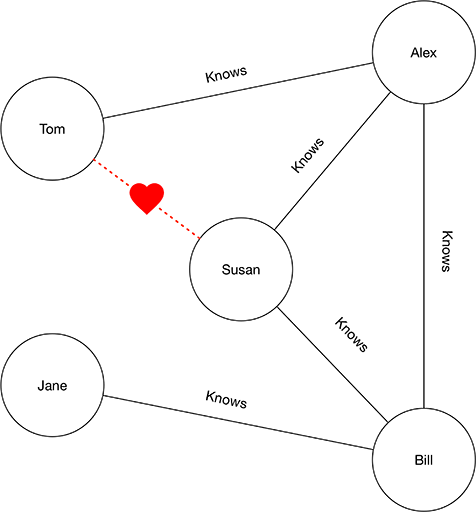
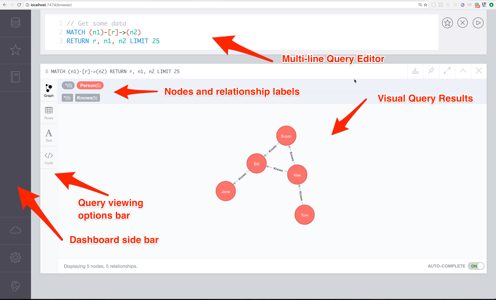

# Graphs, GraphDBs and JavaScript

In this presentation we're going to look at Graph Databases. Before we explore them, we'll consider the importance of graphs, the underlying data structure that allows GraphDBs to exist.

Undoubtedly you're familiar with graphs - those charts showing colored bars, pie slices and points along a line. They're great data visualization tools designed to quickly convey information. However, those are not the type of graphs we'll consider.


Instead, the graphs we're interested in consists of circles and lines and are commonly known as network graphs.


This is the same graph defined in scientific terms, i.e. mathematics and computer science.


A "thing" is represented by a **vertex** and a "link" is referred to as an **edge**. We can think of the vertices as representing nodes and the edges as the relationship between them. From here on out we'll simply refer to them as **nodes** and **links**.

Graphs can take on real world meaning, such as revealing the relationships between people. For example, in this graph, Tom knows Alex but doesn't directly know Bill or even his neighbors, Susan and Jane. If Tom wanted to meet Susan, he could ask Alex to introduce them.



Graphs can become quite complex when lots of nodes and links exists, such as with a web of social acquaintances on Facebook and LinkedIn.


## Graphs revealed

Graph diagrams came about as a leisurely pursuit of [Leonard Euler](https://en.m.wikipedia.org/wiki/Leonhard_Euler) a Swiss-born mathematician who is widely regarded as the most prolific mathematician of all time.


In 1736, from his home in Saint Petersburg, Euler turned his attention to a puzzle which was proposed by the people of the nearby town of Königsberg - which is now the Russian city of Kaliningrad. During a time of great prosperity, the people of Königsberg constructed seven bridges across the Pregel River to connect two islands to the surrounding landscape.

The town's people pondered whether it was possible to cross the seven bridges without crossing one twice.

In a short paper, Euler offered a proof that such a path could not exist. We won't get into the proof here because it isn't the proof that we're interested in, but rather the way in which Euler approached the problem.


Euler represented land masses as nodes and used links to represents bridges. He then assigned each of the nodes a letter from A to D. With this, Euler inadvertently founded an extensive branch of mathematics called graph theory - to which many other well-known mathematicians have since contributed.

## Graphs are everywhere

Today, researchers are using graphs to understand diverse topics such as biodiversity, terrorist networks, and the spread of global epidemics.

Here is a graph that links 40 of the earliest known AIDS patients by sexual contact.


You may have taken a train on your way to this presentation. Did you enjoy riding a graph?

If you consider a map of the New York City subway system - or any subway in the world for that matter - and if you label the train stations as nodes and the routes connecting stations as links - you'll quickly see a graph emerge.


A look at cities throughout the world reveal airports, and in larger cities - airport hubs - which connect flights to other flights and destinations around the globe. Yes, the paths of air travel, and ships, also form a network graph.


Consider 3D games, the characters and terrains are built from wire frame models called meshes, which are essentially graphs.  


The process of applying a skin (texture) to a wire frame model involves mapping an image onto the surface area within vertices and edges - a process known as texture mapping.

Ever wonder how computer game characters find their way within a game word? Dijkstra's algorithm, employed in computer game AI, is used for path finding using a weighted graph.

Turning our attention to nature, here we see the remains of leaves which have been devoured by insects. The veins that remains shows the passages by which water was once delivered to vibrant leafy greens. If you recall your high school biology class then this image might also look unremarkably similar to our own nervous system and arteries!

And that's no coincidence. Doctors save lives by manipulating those network graphs! True story!


In fact, we need go no further than our thoughts to realize that the neurons in our own brains form a network graph. Indeed graphs are everywhere.


## Wet-ware

Not only do our own bodies consists of graphs, it turns out that graphs are fundamental to how we actually think!

Since infancy, we catalog objects and assign properties to them, we then map objects to one another based on their relationship. This process continues in our minds throughout our lives.

Think about any complex topic you've had to learn. Perhaps you began by reading introductory material that provided you a high-level overview. During that process, you were exposed to new terms. And as you learned more about them you were able to associate characteristics or properties to those terms. As you continued learning, you were able to identify relationships allowing you to associate a topic to other topics you already understood.

It turns out that our memories are a sort of graph database. In fact, one way of improving memory is to create new links (or associations) to existing memories.  

Not only do our brains build graphs, we've taught machines to do so as well, using the science of machine learning.

## Graph databases

This all brings us to Graph Databases - software tools for building and working with graphs.

Rather than organize data as collections of tables, rows, and columns - or even as collections of documents - graph databases allow us to model data and relationships in the ways that closely mirror how we naturally think about them.

Let's take a closer look. In this graph, we have nodes and links that both have associated properties. This type of graph is often referred to as a property graph. We have `age` and `interest` properties associated with each person, and we could have easily added other personal characteristics. In the links, we've associated information about when a relationship began.


Such a graph could become the basis for an intelligent contact management application.

## Enter Neo4j

To explore graph databases we're going to use the world's most popular graph database, Neo4j. Affectionately referred to by fans, as Neo.

You can download and install a free copy of Neo from https://neo4j.com/download/community-edition

However, being a big fan of Docker, I prefer to download and run Neo4j from a Docker container.

```
$ docker pull neo4j:3.1.0
$ docker run -d -p 7474:7474 -p 7687:7687 -v ~/data:/data --name neo4j neo4j:3.1.0
```

## Neo4j dashboard

Neo4j comes with a web-based dashboard that allows you to interact with Neo. It's a great way to initially learn about Neo and later create and test your data models. Not only is it an indispensable tool, it's also a real pleasure to use.

Here we see a dashboard view which allows us to enter queries and graphically see the results.  Connecting to an instance of Neo is as simple as pointing your browser to http://localhost:7474



## Neo4j queries

Neo4j has a declarative query language called Cypher. Cypher queries consist of statements that use patterns to specify paths within a graph.

In Cypher syntax, a node is represented inside of parentheses and links are referred to by lines and square brackets. Node and link properties are specified using curly braces.

For example:

```
 (NODE)        [RELATIONSHIP]          (NODE)
(Person)-[:KNOWS {since: "20120225"}]-(Person)
```

So not only are queries declarative, they're also visually descriptive.

Let's take a closer look.

We can locate the graph node representing Alex with this query:

```
MATCH (p:Person {name: "Alex"})
RETURN p;
```

There are a few important characteristics in the query shown. On the first line, we see that we're trying to match a node, represented by a query enclosed in parentheses. The p:Person fragment says "create a variable called p with a label of Person". So here we learn that nodes can have labels (Person) and that we can assign them to variables (p).  On line two we simply return the contents of p.

We can also specify the use of properties and query values by listing them within curly braces. So, `{name: "Alex"}` says we're interested in only matching nodes which have a name property containing the value of "Alex".

If we wanted to return all the people in our graph, our query would be even simpler:

```
MATCH (p:Person)
RETURN p;
```

Alex is connected to Susan by a relationship link with a label of `Knows`. That link also has a property called `since`. We could write a query that includes the relationship by using square brackets:

```
MATCH (p1:Person {name: "Alex"})-[r:Knows]-(p2:Person {name: "Susan"})
RETURN p1, r, p2;
```

Notice that we assign the variable `r` to the relationship link. We also use the label `Knows` to specify the type of link we're interested in.

Let's say that Alex is planning a party and would like to invite his closest acquaintances. Here we omit the query fragment for the Person's name property so we match any person that Alex directly knows.

```
MATCH (p1:Person {name: "Alex"})-[r:Knows]-(p2:Person)
RETURN p1, r, p2;
```

Now let's say that Alex is at a bar and is feeling pretty good. Perhaps better than usual. He yells out to the bartender "The next round is on me!".  Here we omit the `Knows` relationship label because it's unlikely that Alex knows everyone in the bar.

```
MATCH (p1:Person)-[]-(p2:Person)
RETURN p1, p2;
```

Let's consider one final example. Susan is planning to open her first dance studio and needs business advice. She doesn't immediately know a person with an interest in business, but her dad Bill does.

Here's one way to write the query:

```
MATCH (p1:Person {name: "Susan"})-[r:Knows*2]-(p2:Person {interest: "business"})
RETURN p1, r, p2;
```

The new bit is the syntax `-[r:Knows*2]-`. This is known as a variable length relationship. Here we're saying "Match a Person node with the property name="Susan" with one or two Knows relationships to a person with an interest in "business".  Specifying the length is important in order to limit the depth (or hops) that the query traverses to find a match. In a large graph a long traversal might take longer than we'd like.

Referring back to our graph, we can see that if Jane were looking for a chess player we'd have to specify `-[r:Knows*3]-` or three hops to get to Tom - following the green path shown.


You may also notice that there is also a red path from Jane leading to Tom, which involves four hops. Neo4j returns the shorter of the two paths.

This ability to find nodes along variable paths is one of the strengths of Graph Databases. 
Here lies the power of graph queries, the ability to traverse a network of relationships to answer questions such as find me a friend of a friend (or more) who matches a particular criteria. This is also where relational database systems and their use of joins becomes far less than ideal at scale.  Such queries are also how recommendation engines can be used to promote new products. For example: when Amazon lists products also purchased in conjunction with a product you're considering.

## Accessing Neo4j from JavaScript

Neo4j has an HTTP restful API that makes it possible for remote clients to connect to it. You can find a number of libraries on NPM which essential act as wrappers for Neo's restful endpoints.

In fact I wrote a limited and highly opinionated Node library that facilitates connecting to Neo4j and optionally caching results using Redis. You can find it on NPM under the name of Neo4j-redis.

Neo Technologies, the company behind Neo4j, has created the now official [Neo4j Driver for Javascript](https://www.npmjs.com/package/neo4j-driver) NPM package. That's the library we'll use in this presentation. However, I encourage you to look at others which may be more comfortable to use.  

### Installing

```shell
$ mkdir neo-test; cd neo-test
$ npm init -y
$ npm install neo4j-driver
```

### Connecting to Neo

Here is the `alex.js` example from this [presentation's repo](https://github.com/cjus/node-neo4j-presentation). We begin by defining the location of our neo4j database instance. I'm running mine on my laptop, so I specify `localhost`.  The `bolt://` portion tells Neo that we'd like to use the faster binary connection protocol, instead of the HTTP version.

> You can find out more about bolt [here](https://neo4j.com/blog/neo4j-3-0-language-drivers).

We then require the neo4j-driver and prepare an auth object to pass to the neo4j.driver setup. With a driver created we define an error handler.

```javascript
const database = 'bolt://localhost';
const neo4j = require('neo4j-driver').v1;
const auth = neo4j.auth.basic('neo4j', 'omega16');
const driver = neo4j.driver(database, auth);

driver.onError = (error) => {
  console.log('Driver instantiation failed', error);
};
```

Next, we create a driver session and run (execute) a Cypher query.  Note that the run function accepts two parameters and returns a JavaScript promise. The first parameter to run is the query template and the second is an object with the  query's parameters. This allows Neo to cache query plans (template) for added efficiency. We then use the `.then` and `.catch` functions to handle the promise resolve or reject cases.

```javascript
let session = driver.session();
session
  .run(
    'MATCH (p:Person {name: {nameParam}}) RETURN p.name, p.age, p.interest',
    {nameParam: 'Alex'}
  )
  .then((result) => {
    result.records.forEach((record) => {
      console.log(`Name: ${record.get('p.name')}`);
      console.log(`Age: ${record.get('p.age')}`);
      console.log(`Interest: ${record.get('p.interest')}`);
    });
  })
  .catch((err) => {
    console.log('err', err);
  })
  .then(() => {
    session.close();
    driver.close();
  });
```

Here is the output from the previous code. We see the information returned from the Cypher query.

```shell
$ node alex.js
Name: Alex
Age: 34
Interest: parties
```

> To learn more about the neo4j-driver check out the project [documentation](http://neo4j.com/docs/api/javascript-driver/current).

In this next example, we run the query where Susan is checking her network for a person who has an interest in business.  She knows Bill who is her dad and a retired Harvard professor, but she doesn't directly know Jane who took Bill's game theory course at Harvard.


Our query attempts to find a path from Susan to a person with an interest in business.  That person turns out to be Jane.

```javascript
const database = 'bolt://localhost';
const neo4j = require('neo4j-driver').v1;
const auth = neo4j.auth.basic('neo4j', 'omega16');
const driver = neo4j.driver(database, auth);

driver.onError = (error) => {
  console.log('Driver instantiation failed', error);
};

let session = driver.session();
session
  .run(`
    MATCH (p1:Person {name: {seeker}})-[r:Knows*2]-(p2:Person {interest: {interest}})
    RETURN (p1.name + " discovered " + p2.name) AS output`,
    {seeker: 'Susan', interest: 'business'}
  )
  .then((result) => {
    result.records.forEach((record) => {
      console.log(record._fields[0]);
    });
  })
  .catch((err) => {
    console.log('err', err);
  })
  .then(() => {
    session.close();
    driver.close();
  });
```

And the output is:

```shell
$ node business.js
Susan discovered Jane
```

Using the code patterns we've seen you'd able to perform insert, update and delete operations to build more complex applications. Neo4j is really quite approachable.

## Recap

We began our journey by learning about network graphs. Along the way we discovered that graphs are literally everywhere we look. In fact, network graphs could not be closer to our hearts - if you consider the network of arteries within our own bodies.

We also learned that we actually think in terms of graphs and that graph databases are a natural extension for representing our data models and their relationships.

If you're building non-trivial applications then familiarity with graph databases should be an asset! I invite you to take these next steps.

## Next steps

* If you enjoyed this presentation say thanks by staring the github repo. https://github.com/cjus/node-neo4j-presentation
* Visit the Neo4j website: https://neo4j.com/
* Download their free book: https://neo4j.com/graph-databases-book
* Enroll in a free online training course: https://neo4j.com/graphacademy/online-training/introduction-graph-databases
