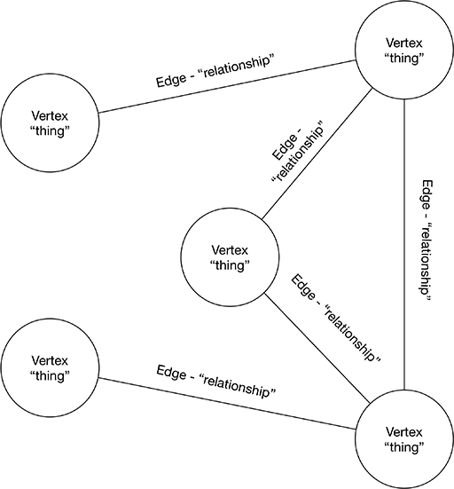
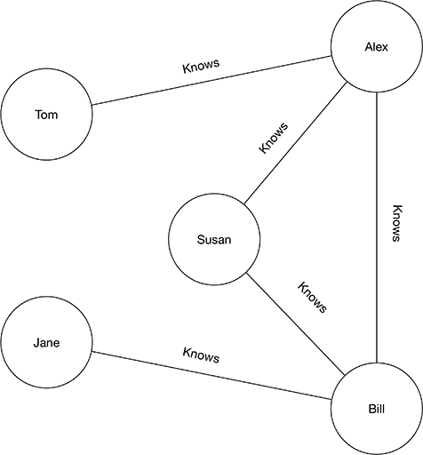
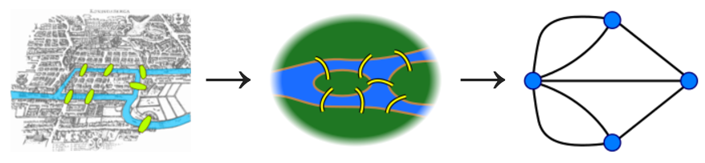

# Presentation Script

## Introduction

In this talk we're going to look at a class of NoSQL db's called graph databases.

We'll examine how graph databases depart sharply from the relational types of databases that many of us are familiar with.

Let's begin. But first what is a graph?

## Graphs

In this presentation we won't concern ourselves with these types of graphs:


The graphs we'll consider consists of circles and lines and are commonly known as network graphs.


This is a graph defined in scientific terms, i.e. mathematics and computer science.



A thing is represented by a **vertex** and a link is referred to as an **edge**. We can think of the vertices as representing things and the edges as the relationship between them. In this presentation we'll simply refer to them as nodes and links. 

A graph can take on real world meaning, such as the relationships between people. In this graph Tom knows Alex but doesn't directly know Bill or even his neighbors Susan and Jane. If Tom wanted to meet Susan he could ask Alex to introduce them.



Graphs can become quite complex, such as with social acquaintances on LinkedIn or Facebook.


We'll see additional examples of graphs throughout this presentation.

## Leonard Euler

Graphs diagrams came about as the leisurely pursuit of [Leonard Euler](https://en.m.wikipedia.org/wiki/Leonhard_Euler) a Swiss born mathematician who is widely regarded as the most prolific mathematician of all time.


In 1736, from his home in Saint Petersburg, Euler turned his attention to a problem which was much talked about by the people of the nearby town of Königsberg - which is now Kaliningrad in Russia. During a time of great prosperity the people of Königsberg created seven bridges across the Pregel River to connect two large islands with the surrounding land.

The people of Königsberg pondered whether it was possible to cross the seven bridges without crossing one twice.

In a short paper, Euler offered a proof that such a path could not exist. Don't worry we wont get into the proof here. For this discussion it isn't the proof that we're interested in but rather the way in which Euler approached the problem.

Euler represented the land masses as vertices and used links to represents the bridges. He then labeled each vertex with a letter from A to D. That is believed to be the first example of a topology being represented as a graph.



With this, Euler inadvertently founded an extensive branch of mathematics called graph theory - to which many other well known mathematicians have since contributed.

## Graphs are everywhere

However, graphs didn't start with Euler, his keen contribution was in how to visualize and discuss them in the context of mathematics.

In truth, graphs are everywhere.

If you consider a map of the New York City subway system - or any subway in the world for that matter - and if you label the train stations as nodes and the routes connecting stations as links you'll quickly see a graph emerge.


A look at cities throughout the world reveal airports, and in larger cities - airport hubs - which connect flights to destinations around the globe.  


Graphs are heavily employed in logistics which tries to find efficient paths for the delivery of goods. This allows companies such as FedEx to maintain competitive advantages in global distribution.


Consider 3D games, the characters and terrains are built from wireframe models called meshes, which are essentially graphs.  


> As a quick aside, the process of applying a skin (texture) to a wireframe model is essentially the mapping of an image onto the area (faces) created by vertices and edges.

That's all very cool - but we need go no further than our own thoughts to realize that the neurons in our own brains form a network graph.


Indeed graphs are everywhere.

## Graphs power Google search and social networks

If it were not for a study of graphs we wouldn't have Google (page rank), Facebook, LinkedIn and Twitter. 

## Why graphs

Graphs are appealing because they closely model how we think.

That is, since infancy we catalog objects and assign properties to them. We then map objects to one another based on their relationship, and we continue refining our understanding throughout our lives.

Think about any complex topic you've had to learn. Perhaps you began by reading introductory material that provided you a high level overview. During that process you were exposed to new terms and as you learned more about them you were able to associate characteristics or properties to those terms. As you continued learning you were able to identify relationships allowing you to associate a topic in relations to other topics you already understood.

Indeed it's highly unlikely that you built a relational table and created foreign keys to build complex joins - in order to map your understand.  That's not how our brains work.

## Graph databases

Rather than organize data as collections of tables, rows and columns - or even as collections of documents - graph databases allow you to model data and relationships in a way that closely mirrors how you naturally see and describe them.

Let's take a closer look. In this next graph we have vertices (nodes) and edges (links) that both have associated properties. We have an age property associated with each person, and we could have easily added other personal characteristics. In the links we've associated information about when a relationship began.


## Enter Neo4j

To explore graph databases we're going to use the world's most popular graph database, Neo4j. Affectionally referred to as Neo by fans.

There are install packages for setting up an instance of Neo4j on the company website. However I personally prefer to run Neo4j from a Docker container.

## Neo4j dashboard

Neo4j comes a web-based dashboard that allows you to interact with Neo. It's a great way to initially learn about Neo and later create and test your data models. Not only is it an indispensable tool, it's also a real pleasure to use. 

## Neo4j queries

Neo4j has a declarative query language called Cypher. Cypher queries consists of statements that use patterns to specify paths within a graph.

In Cypher a vertex or node is represented inside of parentheses and edges or links are referred to by square brackets. Node or link properties are referred to using curly braces.

For example:

```
(Person)-[:KNOWS {since: "20120225"}]-(Person)
```

Let's take a closer look.

We can locate the graph node representing Alex with this query:

```
MATCH (p:Person {name: "Alex"})
RETURN p;
```

There are a few important characteristics in the query shown. On the first line we see that we're trying to match a node, represented by a query enclosed in parentheses. The p:Person fragment says "create a variable called p with a label of Person". So here we learn that nodes can have labels (Person) and that we can assign them to variables (p).  On line two we simply return the contents of p.

We can also specify the use of properties and query values by listing them within curly braces. so, `{name: "Alex"}` says we're interested in only matching nodes which have a name property with the value of "Alex".

If we wanted to return all the people in our graph, our query would be even simpler:

```
MATCH (p:Person)
RETURN p;
```

Alex is connected to Susan by a relationship link with a label of `Knows`. That link also has a property called `since`. We could write a query that includes the relationship by using square brackets:

```
MATCH (p1:Person {name: "Alex"})-[r:Knows]-(p2:Person {name: "Susan"})
RETURN p1, r, p2;
```

Notice that we assign the variable `r` to the relationship link. We also use the label `Knows` to specify the type of link we're interested in.

Let's say that Alex is planning a party and would like to invite his closest acquaintances. Here we omit the query fragment for the Person's name property so we get any person that Alex directly knows .

```
MATCH (p1:Person {name: "Alex"})-[r:Knows]-(p2:Person)
RETURN p1, r, p2;
```

Now let's say that Alex is at a bar and is feeling good. Perhaps better than usual. He yells out to the bartender "The next round is on me!".  Here we omit the `Knows` relationship label because it's unlikely that Alex knows everyone in the bar.

```
MATCH (p1:Person)-[]-(p2:Person)
RETURN p1, p2;
```

Let's consider one final example. Susan is planning to open her first dance studio and needs business advice. She doesn't immediately know a person with an interest in business, but her dad Bill does.

Here's one way to write the query:

```
MATCH (p1:Person {name: "Susan"})-[r:Knows*2]-(p2:Person {interest: "business"})
RETURN p1, r, p2;
```

The new bit is the syntax `-[r:Knows*2]-`.  Here we saying "Match a Person node with the property name="Susan" with one or more Knows relationships to a person with an interest of "business".  Here lies the power of graph queries, the ability to traverse a network of relationships to answer questions such as find me a friend of a friend (or more) who matches a particular criteria. This is also where relational database systems and their use of joins becomes far less than ideal at scale.  Such queries are also how recommendation engines can be used promote new products. For example: listing products also purchased in conjunction with a product your considering.

## Accessing Neo4j from JavaScript

Neo4j has an HTTP restful API that makes it possible for remote clients to connect to it. You can find a number of libraries on NPM which essential act as wrappers for Neo's restful endpoints. 

I also wrote a limited and highly opinionated Node library that facilitates connecting to Neo4j and optionally caching results using Redis. You can find it on NPM under the name of Neo4j-redis.

Neo Technologies, the company behind Neo4j, has created the [Neo4j Driver for Javascript](https://www.npmjs.com/package/neo4j-driver) NPM package. That's the library we'll use in this presentation.


## Next steps

* Star and clone this presentation: https://github.com/cjus/node-neo4j-presentation
* Visit the Neo4j website: https://neo4j.com/
* Download their free book: https://neo4j.com/graph-databases-book
* Enroll in the online training course: https://neo4j.com/graphacademy/online-training/introduction-graph-databases

